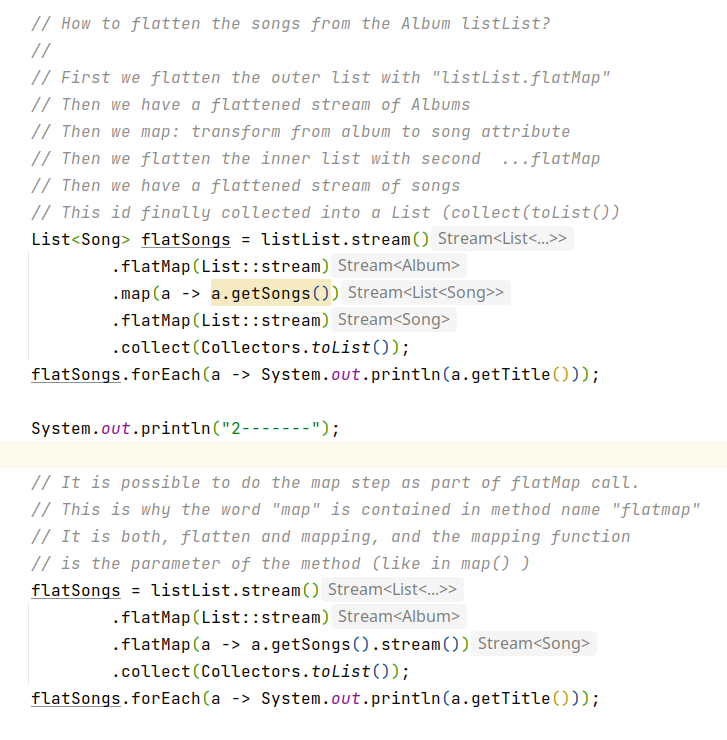

# JavaGems

# Flattening and Mapping in Java

The code is [here](LambdaTests.java).

If we have a complex data structure, like a list from
lists, but we want to process the elements in the inner list,
```flatMap``` can be used.

flatMap does flattening *and* mapping.
So it takes as parameter a mapping function.

E.g. ```a -> a.getName()``` which transforms (maps)
incoming objects ```a```to some of their attribute
```a.getName()```.

In the example of ```List<List<Album>>```, a
```listList.stream().flatmap(List::stream)``` will flatten the list
to a stream ```Stream<Album>```.

Per album, we have again a list, a list of songs.
Again, we can flatten the Stream of Albums
into a stream of songs by applying the mapper
```a -> a.getSongs()``` and flatten, using flatMap().

Because the output of map(), filter() and all those
Lambda methods is a stream, we need to finalize
the processing with a ```collect()```, and the desired
output type, e.g. ```Collectors.toList()```.


